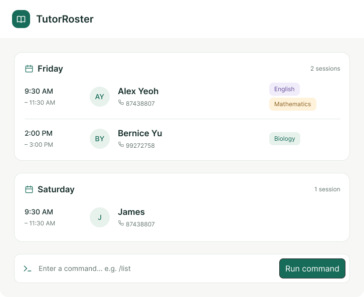

# TutorRoster

## About TutorRoster

**TutorRoster** is a desktop student management application designed specifically for **private freelance tutors** who manage between 10 to 20 students.

Tutors often juggle scattered chat messages, spreadsheets, and sticky notes across multiple devices. **TutorRoster** centralizes all student contact details and tutoring information into a single, cohesive, and distraction-free workspace.

Optimized for tutors who type fast and prefer a **Command Line Interface (CLI)** with the visual clarity of a **Graphical User Interface (GUI)**, TutorRoster allows you to retrieve, update, and manage your students much faster than traditional mouse-driven applications.

---

## Key Features

* **Student & Guardian Profiles**: Track crucial tutoring-specific details including subjects taught, education level, school, parent/guardian contacts, and customized student notes.
* **Rapid CLI-First Workflow**: Perform common operations (adding, searching, filtering, and updating student profiles) with concise keyboard commands.
* **Targeted Search & Tagging**: Quickly filter students by subject, academic level, school, or custom tags without needing to memorize full names.
* **Data Integrity & Safety**: Built-in duplicate warnings, validation checks, and deletion safeguards to keep your records accurate and secure.

> **Note**: TutorRoster focuses on student contact and profile management. It intentionally does not handle lesson scheduling, attendance tracking, billing/payments, or teaching materials.

---

## Documentation

* [User Guide](docs/UserGuide.md)
* [Developer Guide](docs/DeveloperGuide.md)
* [About Us](docs/AboutUs.md)

---

## Acknowledgements
* This project is based on the AddressBook-Level3 project created by the [SE-EDU initiative](https://se-education.org).